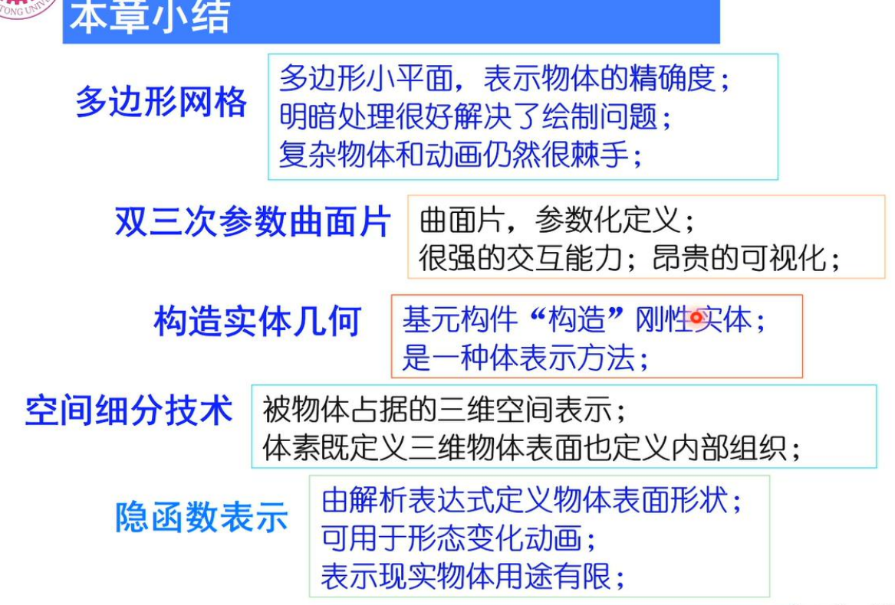

# Review of Computer Graphics
## 概述
### 定义
CG中国定义：研究用计算机表示、生成、处理和显示图形的原理、算法、方法和技术的一门学科。
IEEE：the art or science of producing graphical images with the aid of computer
ISO：一门研究通过计算机将数据转化成图形，并在专门显示设备显示的原理方法和技术的学科。它是建立在传统图学理论、应用数学及计算机科学基础上的一门边缘学科。
### 主要研究内容
#### 60年代
Sutherland 交互图形学
贝塞尔 贝塞尔曲线、曲面理论
Coons 超限插值，4个曲线插值成一个曲面 Coons Award
#### 70年代
光栅显示器诞生：第一个兴盛期
光栅图形学算法迅速发展
图形软件标准化 ISO发布
1. CGI 计算机图形接口
2. CGM ~~源文件标准
3. GKS 计算机图形核心系统
4. PHIGS 面向程序员的层次交互图形标准

真实感图形学、实体造型技术：简单光照模型
#### 80年代
光线跟踪算法
热辐射度模拟漫反射
超大规模集成电路：硬件基础
70年代汉字之难 80年代解决汉字字形的计算机表示
#### 90年代
GPU
全局光照模型
三维造型技术
### 交互式图形系统的概念框架
与设备无关、与应用无关
CGI规定硬件接口（图形信息的描述与通信）, CGM（图形文件格式）, PHIGS（图形系统标准，应用程序和图形输入输出的中介，功能接口）


三个著名图形系统
OpenGL
DirectX
Postscript
### 典型三维模型
犹他壶
西洋跳板棋
山魈
骨骼模型
炸面圈
大众
斯坦福兔
## 三维物体的形体几何模型与表示
内涵：三维物体计算机表示的数据结构和存储结构；三维物体几何形状数据的获取（怎么得到，怎么存储）
### 多边形网络模型与表示
足够多的多边形平面可无限逼近三维物体表面几何形体。
多边形网格=(点集, 边集, 属性)
属性指定材质
点，边，面表示

点：三维坐标
边：顶点和相邻的面，最外边的面记作λ
面：由哪些边围成
一致性约束：
1. 所有多边形闭合
2. 一个顶点至少有两条边共享
3. 一条边至少是一个多边形的一部分
4. 每个多边形至少有一条公共边
5. 多边形网格是全连通图
6. 相邻顶点的二元关系可以用一个平面图表示（拓扑平面）

属性

多边形网格表示的特点：
1. 构造简单，可表示任意三维物体表面几何形体
2. 已形成完善有效的明暗处理方式、硬件可实现
3. 表示精度与多边形网格数量成正比
4. 表示精度可伸缩是多边形网格模型的追求（增加和减少网格）
5. 可编辑是多边形网格表示的挑战

### 曲面片模型与表示
基元是曲边四边形的曲面片
1. 边是三次曲线
2. 精确参数表示，曲面由数学方程定义，面上的每个点都有定义
3. 三维形状编辑潜力，CAD交互式设计基础
4. 可能是一种更经济的物体几何形状表示方法

### 构造实体几何模型（CSG: Constructive Solid Geometry）
三维基本构造块组合构建的三维物体形体层次表示（搭积木）
CSG是一种分解表示的有序二叉树，叶子结点是体素或形体变换参数，分支结点是正则集合运算（交并差等）或几何变换操作

特点
1. 正则集合运算和几何变换描述三维物体组成过程
2. 隐含表示形体几何边界元素
3. 需特殊绘制或多边形网格转换
4. 支持实现交互式实体建模

个人理解：比较偏高层，靠简单实体的搭建来表示复杂几何体。几何边界等元素隐含在搭建过程中，需要实现底层的绘制和网格等才能真正显示几何图形。对用户友好，适合交互式建模。
### 空间细分表示
把三维物体所在的整个世界空间细分为更小的立方体基元，按是否在物体中标记每一个体素（空间微元）
数据存储结构是八叉树，可表示三维实体内部分层树形结构。八叉树可转成二叉空间分区树（BSP）
光流跟踪具有明显优势
医学图像是主要用途之一
八叉树：

按照上图将一个大体素不断划分为8个小体素
1. 几何形体表示，数据结构简单（非解析表达）
2. 简化了形体集合运算
3. 简化了隐藏线、面消除算法（保持体素空间信息）
4. 占用存储多、形体边界计算不易、形体近似表示

### 小结

考虑技术成熟度和计算资源，多边形网格是交互图形引擎最普及支持的三维物体表面几何形体表示模型。

## 三角网格的几何计算
### 三角网格及其存储表示
三角网格模型：三角形顶点集+顶点间拓扑关系集（边、面等）+属性
两种典型存储结构
#### obj文件格式

3D坐标表示点
用点下标表示面
（点+点间拓扑关系）
#### 双向链接边表（half-edge半边表示）
将三角网格的无向边拆成两条有向边，取其中一个（一般是按逆时针顺序）
精确地表示三角网格：只需存储点和拓扑关系
但如果要遍历某个顶点构成的面，只存储点和拓扑关系就需要遍历整个模型，这显然比较浪费时间。
半边：增加少量存储，提供更方便的访问。
半边e和其对边Opposite(e)对应同一条边
存储信息包括：
1. 顶点id和几何信息，即空间坐标
2. 半边e
   (1) 该半边的源顶点Origin(e)
   (2) 该半边在同一三角形的下一条边Next(e)
   (3) 对边Opposite(e)
   (4) 该半边所属面IncFace(e)

由此便于各种网格上的遍历操作
如获得上一条边
```
Prev(e) = Next(Next(e))
```
半边e指向的顶点
```
Target(e) = Origin(Next(e))
```
PPT上的C++代码定义
```cpp
class vertex{
public:
    int id;
    double x;
    double y;
    double z;
    halfEdge* inc_Edge;
    vertex(int id1, double x1, double y1, double z1): id(id1), x(x1), y(y1), z(z1){inc_Edge = NULL;};
};

class halfEdge{
public:
    int id;
    halfEdge* opposite;
    halfEdge* prev;
    halfEdge* next;
    vertex* origin;
    face* inc_Face;
    halfEdge(int id1): id(id1){opposite=NULL; prev=NULL; next=NULL; origin=NULL; inc_Face=NULL};
};

class face{
public:
    int id;
    halfEdge* inc_Edge;
    face(int id1): id(id1){inc_Edge=NULL;}
};
```
### 三角网格的生成
三角网格生成的本质是将三维物体表面划分为三角形面片
现有传感器很容易获取物体表面离散点的空间坐标。
对区域内一组给定点，Voronoi图是对区域内给定一组基点的单元分区；Delaunay三角剖分完成区域内对给定基点的拓扑连接，形成三角形闭合平面。

二者是对偶关系
#### Voronoi图生成的泰森法

#### Delaunay三角剖分
Delaunay三角剖分是一组相连但不重叠的三角形的集合
空圆特性：两个共边三角形，任意一个三角形的外接圆中都不包含另一个三角形的第三个顶点。


Delaunay三角剖分的意义：
1. 保证剖分产生的三角形最小角最大（最大化最小角）
2. 可避免狭长三角形产生（Delaunay三角剖分应用）
#### Delaunay三角剖分的增量构造方法（Lawson算法）

### 网格简化
目标：保持三角网格对三维物体表面几何形态逼近的条件下，减少网格的顶点、边和三角形面片的数量。
三条技术路线：顶点删除法、边折叠法、面片收缩法

#### 顶点删除法
1. 删除顶点及相邻的面
2. 空洞填补
##### 顶点可删除性判定条件
顶点平均平面距离小于误差阈值
平均平面距离：

n是平均平面法向量，由各相邻面的法向量对面积加权再归一得到。然后用点到面的距离计算出点到平均平面的距离。
##### 空洞填补
删除顶点后就会得到一个大的多边形，对这个大多边形再使用Delaunay三角剖分就可以得到新的三角网格。（凹凸顶点判定的Delaunay三角剖分法）
#### 边折叠法
选择相邻的顶点，删除边(u, v)及其三角形，将两个顶点合并成一个新顶点w
关键问题：折叠边的选择；新顶点的计算

#### 面片收缩法

步骤简述：划分小格，选择小格的代表顶点，将小格中的顶点合并到代表顶点（三角形多个顶点位于同一小格，自然就因为收缩而消失了）
#### 三种方法的总结
顶点删除法：删除不重要的顶点
边折叠法，折叠不重要的边，边顶点合二为一
面收缩法：以小格为单位进行收缩
### 网格细分
与网格简化相反
目标：用更小的三角平面替代原有三角平面，以更加逼近物体表面几何形状。
需要确定几何规则和拓扑规则：怎么打点？怎么连线？
    
    几何规则：计算新顶点的坐标和顶点的新坐标
    拓扑规则：确定新顶点的连接关系
#### Loop细分
三角网格逼近型细分方法（分裂）
1-4三角形分裂法

为了保证参数连续性（个人理解是由于是空间三维坐标系，本来是一个三角形刚性结构，增加顶点后就变软了，可以向四周弯折保证平滑性）：
1. 对原始顶点根据邻接顶点进行坐标更新
2. 新增顶点坐标根据共享边的两个三角形顶点进行坐标更新