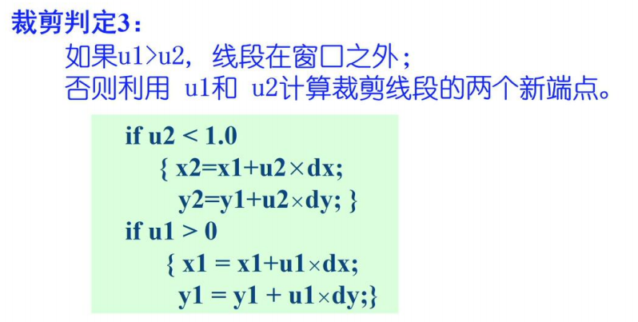
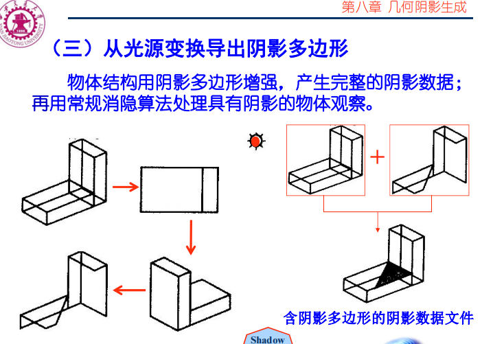
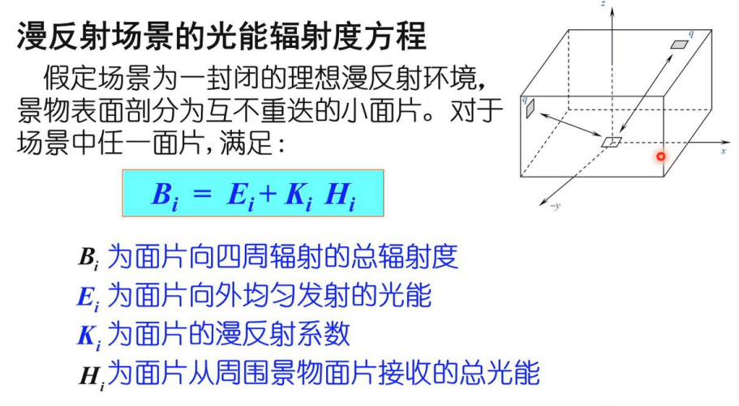
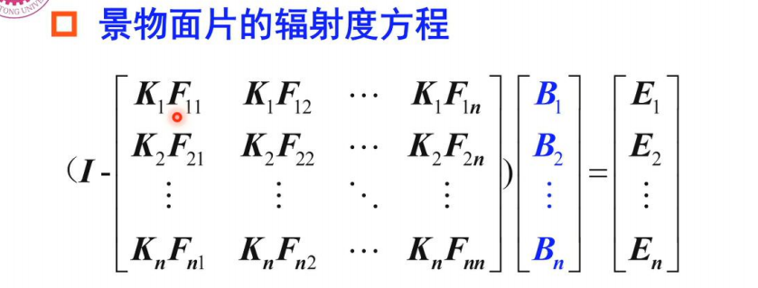
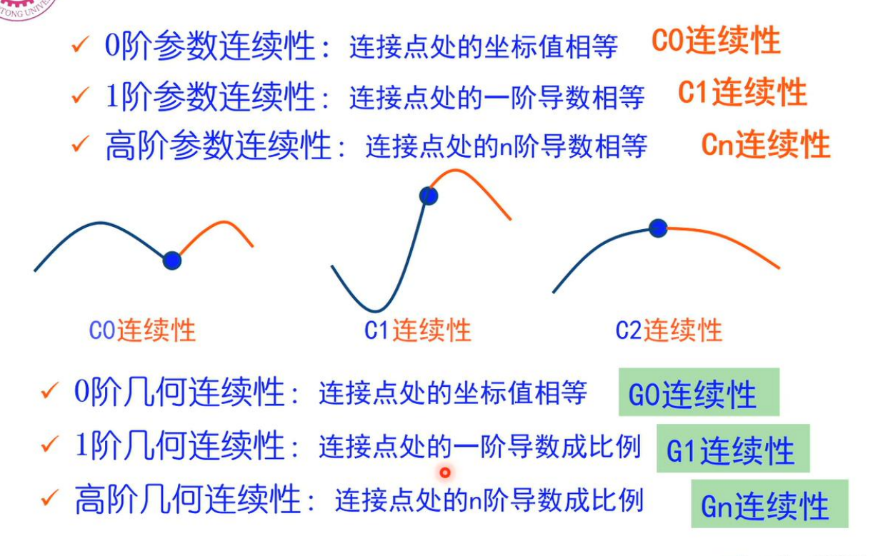
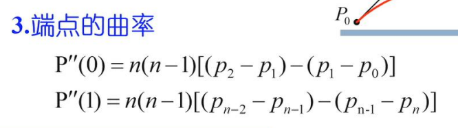
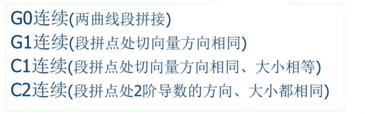
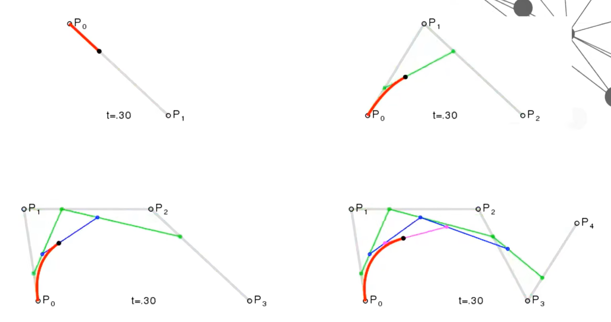

# Review of Computer Graphics
## 1 概述
### 定义
CG中国定义：研究用计算机表示、生成、处理和显示图形的原理、算法、方法和技术的一门学科。
IEEE：the art or science of producing graphical images with the aid of computer
ISO：一门研究通过计算机将数据转化成图形，并在专门显示设备显示的原理方法和技术的学科。它是建立在传统图学理论、应用数学及计算机科学基础上的一门边缘学科。
### 主要研究内容
#### 60年代
Sutherland 交互图形学
贝塞尔 贝塞尔曲线、曲面理论
Coons 超限插值，4个曲线插值成一个曲面 Coons Award
#### 70年代
光栅显示器诞生：第一个兴盛期
光栅图形学算法迅速发展
图形软件标准化 ISO发布
1. CGI 计算机图形接口
2. CGM ~~源文件标准
3. GKS 计算机图形核心系统
4. PHIGS 面向程序员的层次交互图形标准

真实感图形学、实体造型技术：简单光照模型
#### 80年代
光线跟踪算法
热辐射度模拟漫反射
超大规模集成电路：硬件基础
70年代汉字之难 80年代解决汉字字形的计算机表示
#### 90年代
GPU
全局光照模型
三维造型技术
### 交互式图形系统的概念框架
与设备无关、与应用无关
CGI规定硬件接口（图形信息的描述与通信）, CGM（图形文件格式）, PHIGS（图形系统标准，应用程序和图形输入输出的中介，功能接口）


三个著名图形系统
OpenGL
DirectX
Postscript
### 典型三维模型
犹他壶
西洋跳板棋
山魈
骨骼模型
炸面圈
大众
斯坦福兔
## 2 三维物体的形体几何模型与表示
内涵：三维物体计算机表示的数据结构和存储结构；三维物体几何形状数据的获取（怎么得到，怎么存储）
### 多边形网络模型与表示
足够多的多边形平面可无限逼近三维物体表面几何形体。
多边形网格=(点集, 边集, 属性)
属性指定材质
点，边，面表示

点：三维坐标
边：顶点和相邻的面，最外边的面记作λ
面：由哪些边围成
一致性约束：
1. 所有多边形闭合
2. 一个顶点至少有两条边共享
3. 一条边至少是一个多边形的一部分
4. 每个多边形至少有一条公共边
5. 多边形网格是全连通图
6. 相邻顶点的二元关系可以用一个平面图表示（拓扑平面）

属性

多边形网格表示的特点：
1. 构造简单，可表示任意三维物体表面几何形体
2. 已形成完善有效的明暗处理方式、硬件可实现
3. 表示精度与多边形网格数量成正比
4. 表示精度可伸缩是多边形网格模型的追求（增加和减少网格）
5. 可编辑是多边形网格表示的挑战

### 曲面片模型与表示
基元是曲边四边形的曲面片
1. 边是三次曲线
2. 精确参数表示，曲面由数学方程定义，面上的每个点都有定义
3. 三维形状编辑潜力，CAD交互式设计基础
4. 可能是一种更经济的物体几何形状表示方法

### 构造实体几何模型（CSG: Constructive Solid Geometry）
三维基本构造块组合构建的三维物体形体层次表示（搭积木）
CSG是一种分解表示的有序二叉树，叶子结点是体素或形体变换参数，分支结点是正则集合运算（交并差等）或几何变换操作

特点
1. 正则集合运算和几何变换描述三维物体组成过程
2. 隐含表示形体几何边界元素
3. 需特殊绘制或多边形网格转换
4. 支持实现交互式实体建模

个人理解：比较偏高层，靠简单实体的搭建来表示复杂几何体。几何边界等元素隐含在搭建过程中，需要实现底层的绘制和网格等才能真正显示几何图形。对用户友好，适合交互式建模。
### 空间细分表示
把三维物体所在的整个世界空间细分为更小的立方体基元，按是否在物体中标记每一个体素（空间微元）
数据存储结构是八叉树，可表示三维实体内部分层树形结构。八叉树可转成二叉空间分区树（BSP）
光流跟踪具有明显优势
医学图像是主要用途之一
八叉树：

按照上图将一个大体素不断划分为8个小体素
1. 几何形体表示，数据结构简单（非解析表达）
2. 简化了形体集合运算
3. 简化了隐藏线、面消除算法（保持体素空间信息）
4. 占用存储多、形体边界计算不易、形体近似表示

### 小结

考虑技术成熟度和计算资源，多边形网格是交互图形引擎最普及支持的三维物体表面几何形体表示模型。

## 3 三角网格的几何计算
### 三角网格及其存储表示
三角网格模型：三角形顶点集+顶点间拓扑关系集（边、面等）+属性
两种典型存储结构
#### obj文件格式

3D坐标表示点
用点下标表示面
（点+点间拓扑关系）
#### 双向链接边表（half-edge半边表示）
将三角网格的无向边拆成两条有向边，取其中一个（一般是按逆时针顺序）
精确地表示三角网格：只需存储点和拓扑关系
但如果要遍历某个顶点构成的面，只存储点和拓扑关系就需要遍历整个模型，这显然比较浪费时间。
半边：增加少量存储，提供更方便的访问。
半边e和其对边Opposite(e)对应同一条边
存储信息包括：
1. 顶点id和几何信息，即空间坐标
2. 半边e
   (1) 该半边的源顶点Origin(e)
   (2) 该半边在同一三角形的下一条边Next(e)
   (3) 对边Opposite(e)
   (4) 该半边所属面IncFace(e)

由此便于各种网格上的遍历操作
如获得上一条边
```
Prev(e) = Next(Next(e))
```
半边e指向的顶点
```
Target(e) = Origin(Next(e))
```
PPT上的C++代码定义
```cpp
class vertex{
public:
    int id;
    double x;
    double y;
    double z;
    halfEdge* inc_Edge;
    vertex(int id1, double x1, double y1, double z1): id(id1), x(x1), y(y1), z(z1){inc_Edge = NULL;};
};

class halfEdge{
public:
    int id;
    halfEdge* opposite;
    halfEdge* prev;
    halfEdge* next;
    vertex* origin;
    face* inc_Face;
    halfEdge(int id1): id(id1){opposite=NULL; prev=NULL; next=NULL; origin=NULL; inc_Face=NULL};
};

class face{
public:
    int id;
    halfEdge* inc_Edge;
    face(int id1): id(id1){inc_Edge=NULL;}
};
```
### 三角网格的生成
三角网格生成的本质是将三维物体表面划分为三角形面片
现有传感器很容易获取物体表面离散点的空间坐标。
对区域内一组给定点，Voronoi图是对区域内给定一组基点的单元分区；Delaunay三角剖分完成区域内对给定基点的拓扑连接，形成三角形闭合平面。

二者是对偶关系
#### Voronoi图生成的泰森法

#### Delaunay三角剖分
Delaunay三角剖分是一组相连但不重叠的三角形的集合
空圆特性：两个共边三角形，任意一个三角形的外接圆中都不包含另一个三角形的第三个顶点。


Delaunay三角剖分的意义：
1. 保证剖分产生的三角形最小角最大（最大化最小角）
2. 可避免狭长三角形产生（Delaunay三角剖分应用）
#### Delaunay三角剖分的增量构造方法（Lawson算法）

### 网格简化
目标：保持三角网格对三维物体表面几何形态逼近的条件下，减少网格的顶点、边和三角形面片的数量。
三条技术路线：顶点删除法、边折叠法、面片收缩法

#### 顶点删除法
1. 删除顶点及相邻的面
2. 空洞填补
##### 顶点可删除性判定条件
顶点平均平面距离小于误差阈值
平均平面距离：

n是平均平面法向量，由各相邻面的法向量对面积加权再归一得到。然后用点到面的距离计算出点到平均平面的距离。
##### 空洞填补
删除顶点后就会得到一个大的多边形，对这个大多边形再使用Delaunay三角剖分就可以得到新的三角网格。（凹凸顶点判定的Delaunay三角剖分法）
#### 边折叠法
选择相邻的顶点，删除边(u, v)及其三角形，将两个顶点合并成一个新顶点w
关键问题：折叠边的选择；新顶点的计算

#### 面片收缩法

步骤简述：划分小格，选择小格的代表顶点，将小格中的顶点合并到代表顶点（三角形多个顶点位于同一小格，自然就因为收缩而消失了）
#### 三种方法的总结
顶点删除法：删除不重要的顶点
边折叠法，折叠不重要的边，边顶点合二为一
面收缩法：以小格为单位进行收缩
### 网格细分
与网格简化相反
目标：用更小的三角平面替代原有三角平面，以更加逼近物体表面几何形状。
需要确定几何规则和拓扑规则：怎么打点？怎么连线？
    
    几何规则：计算新顶点的坐标和顶点的新坐标
    拓扑规则：确定新顶点的连接关系
#### Loop细分
三角网格逼近型细分方法（分裂）
1-4三角形分裂法

为了保证参数连续性（个人理解是由于是空间三维坐标系，本来是一个三角形刚性结构，增加顶点后就变软了，可以向四周弯折保证平滑性）：
1. 对原始顶点根据邻接顶点进行坐标更新
2. 新增顶点坐标根据共享边的两个三角形顶点进行坐标更新
## 4 多边形网格的三维物体绘制
### 图形绘制流水线
图形绘制流水线是将多边形网格表示的三维物体表面几何形体转换为能在显示设备上显示的、经过明暗处理的像素亮度计算过程。
三维物体几何--计算--→能显示的像素

模型→世界坐标表示→观察→显示到设备
### 可见面判定与隐藏面消除
真实感绘制的要求，消除被遮挡的不可见线面，在二维显示设备把三维物体表面的当前可见表面绘制出来。
#### Z-Buffer
最简单的可见面判定算法
帧缓存F：存储每个像素的颜色值
深度值缓存Z-Buffer：存储像素对应点的最小深度值

```cpp
void zBuffer(){
    int x, y; // 投影平面坐标
    for(y = 0; y < YMAX; y++)
        for(x = 0; x < XMAX; x++){
            WritePixel(x, y, BACKGROUND_VALUE);
            WriteZ(x, y, ZMAX);
        }
    // 绘制背景，将背景置于最底层
    for(每个多边形)
        for(投影中的每个像素){
            double pz = (x, y)处的深度z值
            if(pz < ReadZ(x, y)){
                WriteZ(x, y, pz);
                WritePixel(x, y, (x, y)处的颜色值)
            }
        }
    // 记录最小深度
}
```

优点：易于硬件实现
缺点：
1. 需要较大容量的Z-Buffer
2. 每个像素对应多边形区域的深度计算
3. 实现反走样、透明和半透明效果困难（因为是在投影面上操作的，并且只记录了浅层的值）

不要求图形一定是多边形组成的，只要确定对象投影每个点的深度和像素值就可以绘制。
#### 光线投影算法
最自然的消隐算法
基本思想：考察由视点出发穿过观察平面的一像素而射入场景的一道射线，则可确定场景中与该射线相交的物体（模拟一道光照）
```cpp
for(屏幕的每一像素){
    形成通过屏幕像素(u, v)的射线;
    for(场景中的每个物体){
        将射线与该物体求交;
        if(存在交点)
            以最近交点所属颜色显示像素(u, v);
        else 以背景色显示像素
    }
}
```

#### 深度排序算法（画家算法）
最偷懒的消隐算法
原理：把表示三维实体的每一个多边形按距离视点由远及近排序，构成一张深度优先表，按照顺序逐个绘制各个多边形。
总体评价：
1. 多边形面片数量很大时，画家消隐算法最快（因为GPU结构？）
2. 不能处理多边形循环遮挡、相互穿透
3. 解决办法：分割多边形面片

### 多边形网格裁剪
显示设备视窗大小固定，显示实体范围有限，可避免不必要的无效计算，节省计算资源。
#### 直线段裁剪
##### Cohen-Sutherland算法
端点区位码判定
直线上的所有点按照4位码编码，分别代表(上, 下, 右, 左)是否出界，例如右上角的点编码就是1010

算法流程
1. 找出直线段端点的编码code1, code2
2. code1 | code2 == 0（二者都是0000），线段完全位于窗口内；code1 & code2 != 0，线段完全位于窗口外
3. 不属于2的情况，线段部分在窗口内，取线段的一个端点p
4. 从p编码的低位向高位找的第一个1，确定一个相交的边界，求出线段与该边界的交点，用该交点代替p作为端点，外围的剪裁掉
5. 重复4直到没有窗口外的点

##### 梁友栋-Barsky算法
参数推理判定的线段剪裁算法
利用直线的参数方程

选择一个端点作为起始点P0，另一个端点作为终止点P1，二者相减得到Δx, Δy
把上图中的式子转化一下可以得到如下形式的式子

up~k~ ≤ q~k~

然后就可以利用p和q进行判断




u其实就是线段到边界的裁断比例

##### Nicholl-Lee-Nicholl算法
专门针对二维剪裁
分情况大势判定的算法，比较运算和除法运算执行次数远少于前两种


#### 二维多边形剪裁
##### Sutherland-Hodgeman剪裁
将多边形看作整体，对所有多边形顶点进行处理（把裁剪过后的所有相邻顶点都连起来）


问题：
剪裁凹多边形时可能出现多余的边

解决策略：将凹多边形转成凸多边形
Weiler-Atherton算法不会有这个问题
##### Weiler-Atherton算法
按照一定的方向处理顶点

绿色箭头所示的两条边是从内向外的，所以沿着边界顺时针的方向去连，把顶点连到各自的区域去，而不会出现多余的边。
#### 三维视见体与线段裁剪

二维扩展到三维
将Cohen-Sutherland的端点区位码方法扩展一下变成6位，即
(后, 前, 上, 下, 右, 左)
## 5 光栅化计算
光栅显示器看作一个pixels矩阵，每个pixel对应一个显示色彩亮度的物理小区域，每个小区域显示一致的色彩亮度，显示屏的可用pixel有限。

光栅化：确定显示屏最佳逼近图形的pixels集合，并指定pixel属性的过程

像素扫描变换：图元到光栅显示器的pixel中心采样过程

数学图元→有限的像素
### 直线扫描转换算法
无限→有限
数学直线无宽度、无限个点

直线光栅化：在有限可用像素中，确定最佳逼近直线的一组像素
#### 基本增量算法（数值微分DDA法）

直接采样pixel，绘制线宽为pixel的直线（涉及四舍五入，最近邻插值？）
```cpp
void DDALine(int x0, int y0, int x1, int y1, int value){
    int x;
    double dx = x1 - x0;
    double dy = y1 - y0;
    double k = dy / dx;
    double y = y0;
    for(x = x0; x < x1; x++){
        WritePixel(x, Round(y), value);
        y = y + k;
    }
}
```

问题：
1. 仅适用于|k|≤1的情况，|k|>1时需要颠倒x, y（不然就不是连续采样了）
2. x, y, k用浮点数表示，且需四舍五入取整，不利于硬件实现（浮点数转整型）

#### 直线扫描转换的中点线算法
上一个算法中涉及浮点运算。此算法的目标是只使用整型运算，根据当前点计算下一个像素点。

中点方法：两个光栅像素点P1, P2，中点M，考察M与直线的相对位置，直线在M上方则选择P2，否则选择P1
（以中点作为参考点，这样就不用四舍五入了）

```cpp
void MidpointLine(int x0, int y0, int x1, int y1, int value){
    int x;
    int dx = x1 - x0;
    int dy = y1 - y0;
    int d = 2 * dy - dx; // d>0则高于中点，反之低于
    int incrP1 = 2 * dy;
    int incrP2 = 2 * (dy - dx);
    int x = x0; int y = y0;
    WritePixel(x, y, value);
    while(x < x1){
        if(d > 0){
            x++;
            y++;
            d += incrP2;
        }
        else{
            x++;
            d += incrP1;
        }
        WritePixel(x, y, value);
    }
}
```
#### Bresenhanm直线转换算法
改变了中点线算法选择pixel的判据（判定条件）

将d维持在[0, 1]的范围内不断累加，d就代表了在栅格内的相对位置，大于0.5则在中点之上，小于0.5则在中点之下。
转换一下：用 e = d - 0.5 的正负来判断。
```cpp
void Bresenham_Line(int x0, int y0, int x1, int y1, int value){
    int x;
    int dx = x1 - x0;
    int dy = y1 - y0;
    double k = dy / dx;
    double e = -0.5;
    int x = x0;
    int y = y0;
    while(x < x1){
        WritePixel(x, y, value);
        x++; e += k;
        if(e > 0){
            y++;
            e--;
        }
    }
}
```

将2e*dx替换为e'，用这种方法可以用整型表示e，不再需要浮点，直接代入dx, dy进行计算，也不需要斜率k。
```cpp
void Bresenham_Line(int x0, int y0, int x1, int y1, int value){
    int x;
    int dx = x1 - x0;
    int dy = y1 - y0;
    int e = -dx;
    int x = x0;
    int y = y0;
    while(x < x1){
        WritePixel(x, y, value);
        x++; e += 2 * dy;
        if(e > 0){
            y++;
            e -= 2 * dx;
        }
    }
}
```

### 三角形的像素扫描转换
多边形像素扫描对多边形形状无要求，但多边形边界必须封闭且不自交。
过程：
1. 求交：计算扫描线与多边形各边交点
2. 排序：把所有交点按x值递增排序
3. 配对：确定交点对，区分扫描线与多边形的一个相交区间
4. 着色：按照先滤波后采样策略把相交区间内采样像素置为滤波后的亮度

#### 求交

拉一根扫描线，求扫描线与多边形交点
#### 交点配队的内外测试
画出多边形轮廓后要对内部着色，如何判断一个点在多边形内部还是外部？
##### 奇偶规则
从D向多边形远点引一条射线，射线与多边形有偶数个交点则D在多边形外（一进一出），反之在内
##### 非零环绕数规则
沿着射线走，观察边穿过射线的方向，从右往左+1，从左往右-1，最后如果是0就在外部，反之在内（原理和上边差不多）
#### 边界填充算法
从内部点开始，从内向外绘制点直到边界

没细讲，也不知道都是个啥东西

### 走样与反走样
在光栅显示中，用离散量表示连续量引起的失真现象称为走样，反走样是减轻或除去走样的技术。
基本策略
1. 提高分辨率
2. 像素采用不同的亮度值


锯齿的数目随着分辨率的提高而增加，但是尺度变小了（变成小锯齿）且依赖硬件的进步（需要从硬件上才能提高分辨率）

#### 提高分辨率
要真正地提高分辨率需要硬件进步。折中方法：利用提高分辨率的思想，在不用提高实际分辨率的情况下降低失真

子像素法：
在高于显示器分辨率条件下采样像素，平均相关近邻像素属性，得到较低分辨率下的像素属性。


#### 像素采用不同的亮度值
CV里边学过，对失真的图像做一下平滑可以降低失真


## 6 局部光照模型与明暗处理
像素亮度的计算原理和方法。光照模型是三维物体表面光强度计算的物理依据。
依据：光照明模型
计算方法：像素绘制算法

局部光照模型：仅考虑光照直接照在物体表面，物体之间的光照模拟为环境光
全局光照：还要考虑光照在物体之间的相互作用

### 局部光照模型：像素级光强计算
光源：点、线、面光源
光谱：白色、彩色、单色
光的传播：入射光、环境光、理想漫反射、非理想镜面反射
影响物体表面光强的因素：物体表面几何形状（法向量）、光源、环境（遮挡、反射、折射），视点位置和物体表面材质属性（如材料、光洁度等）

一些光学知识

#### 简单光照模型-环境光
原理
1. 假设物体不透明
2. 环境光*I~a~*，在空间近似均匀分布，在任何位置、任何方向强度相同
3. 环境光反射系数*K~a~*，均匀光照射下物体表面反射系数

得到光照明方程
物体表面亮度 *I~e~* = *I~a~* × *K~a~*

缺点：虽然不同物体不同亮度，但同一物体亮度一致，没有明暗变化。

#### 理想漫反射
原理
1. 点光源：由一点向空间所有方向辐射等强度光
2. 漫反射：粗糙无光泽物体表面对光的均匀反射


将漫反射和环境光结合：*I* = *I~e~* + *I~d~*

缺点：对金属球、光滑塑料等物体不适用，因为没有镜面反射。

#### 非理想镜面反射
原理
1. 镜面反射：光滑物体表面对光的反射
2. 高光：入射光在光滑物体表面形成特别亮的区域


会反射出一系列的光，理想反射光的方向最亮，周围较弱。（会形成一个高亮区域）公式中的n是高光系数，n越大高光越集中


#### Blinn-Phong模型
真实感图形学中第一个有影响的模型
点P光强为环境光+漫反射+镜面反射
*I* = *I~e~* + *I~d~* + *I~s~*

注意一系列近似操作

彩色：对RGB每个基色建立一个光照模型

经验模型，存在以下问题
1. 物体像塑料，缺乏质感
2. 环境光是常量，没有考虑物体间的反射光
3. 镜面反射的样色是光源颜色，与物体材料无关
4. 镜面反射计算在入射角很大时出现失真

### 插值明暗处理：多边形表面光强计算
像素级光强的马赫带效应：
物体表面反射光强实际上是表面法向量的函数，而多边形网格的三维物体由多边形组成，每个多边形内部点法向量都相同，多边形之间法向量变化不连续，所以绘制分别计算的亮度在多边形交界处会产生突变（明暗不连续变化）

恒定明暗处理：对每个多边形表面只计算一次亮度，只适用于光源、视点都在无穷远处，且多边形不是在对物体表面曲面进行逼近的情况。

插值明暗处理：多边形内部亮度值根据顶点亮度或法向参数插值得到（多边形内部亮度不一）在对象空间以多边形为基本单元计算物体表面的光强度

#### Gouraud明暗处理算法
思想：每个顶点根据其构成的各平面法向量计算平均法向量，并以此计算亮度，然后按照横向距离插值得到各边点亮度，再得到内部各点亮度。


反其道而行：折痕效果的产生


#### Phong明暗处理算法
思想：先得到各顶点的平均法向量，然后直接插值得到各点的法向量再进行Phong模型计算

#### 算法比较
Gouraud：亮度插值，特征层融合
Phong：法向量插值，数据层融合
Phong比Gouraud更真实，主要体现在高光区域的扩散和产生正确的高光区域，但计算量远大于G


## 7 表面纹理映射技术
局部光照模型只考虑表面几何形状，假设反射率是常数，只能差生颜色单一的物体表面，难以表现物体表面的丰富纹理细节。表面纹理映射技术是丰富物体表面细节的真实感绘制技术之一。

    颜色纹理：各种花纹、图案、文字等图像数据
    几何纹理：基于景物表面微观几何形状的表面纹理，如岩石等表面呈现的凹凸不平的纹理细节
    过程纹理：表达各种规则或不规则动态变化自然景象如水波、云、火、烟雾。

### 二维纹理映射过程
表面上是将二维纹理图像映射到三维物体空间，再将物体投影到屏幕空间的变换过程。本质是建立纹理空间与物体空间的映射关系。

前向映射和反向映射
和CV里的一样，前向映射是由纹理空间找屏幕空间，反向映射是由屏幕空间（观察平面空间）像素需求驱动，通过纹理映射空间反向映射“预置图像”求得。
#### 利用双线性插值的反向映射
好像完全就是CV里边那个反向映射双线性插值算法。


#### 利用中间表面进行反向映射
在物体表面与纹理空间关联未知的情况，获得表面顶点与纹理坐标的对应关联；中间表面方法将纹理空间到物体空间映射分解为两个简单映射的复合，解决无参数化曲面的纹理映射问题。

定义一个中间表面，一般是圆球或者圆柱面，做纹理空间→三维中间表面→物体空间的关联映射。

    S映射：完成纹理空间到三维中间表面空间的映射
    O映射：进行中间表面与物体空间的关联映射。关联映射完成纹理空间与物体几何表面顶点关联。

O映射四种关联方法
1. 反射光线法。固定一个点光源，将物体上的点和反射光射到的中间表面点做关联。
2. 物体法向法。在物体表面点沿物体法向做射线，关联线上的物体表面点和中间表面点。
3. 物体质心法。由物体质心向外做射线，关联线上的物体表面点和中间表面点。
4. 中间表面法向法。从中间表面出发，沿法向做射线。


### 凹凸映射技术
产生凹凸不平的效果
对物体表面各采样点做微小扰动，改变表面的微观几何形状，从而引起物体表面法向变化。由此可导致表面光亮度计算值的突变，巧妙利用人类视觉的马赫带效应产生表面凹凸不平的真实感绘制渲染效果。

    人类视觉马赫带效应：人类视觉对物体表面亮度的突变很敏感

#### 几何扰动法
直接对物体表面采样点P(u, v)做扰动，沿其法向附加一微小增量。

#### 法向扰动法
扰动表面的法向量（对于表面来说也相当于改变了高度，只是这个值我们不关心）

改变了 *P~u~, P~v~* 的方向，法向量N是u, v的叉乘，相应地也改变。

### 范例 真实感3D人脸绘制


把人脸图片做成了贴图

### 二维纹理映射的走样问题
***了解***
二维图像分辨率与纹理映射需要不匹配时出现走样。比如二维图像分辨率很高，显示空间一个像素对应很多纹理，如果只取一点就会突变、走样。
思路：对纹理图进行平滑；像素映射后对应的纹理区域取平均

## 8 透明与几何阴影
### 简单透明模型
***PPT里没有，新版PPT不知道***
简单透明模型不考虑折射现象，可见透明面取其后相邻最近表面光强的线性组合。

算法：基于Z-Buffer，再设置透明光强、透明加权因子两个缓存器，在几何形态表示的多边形数据结构中标记“透明多边形”。
算法流程：筛选透明多边形、预处理非透明多边形、处理透明多边形、更新帧缓存

其实就是在帧缓存计算中分开来考虑非透明和透明物体，由于透明物体的计算是非透明物体叠加得到的，所以要先处理非透明物体，再计算透明物体，最后更新缓存。

### 几何阴影生成
几何阴影强化物体间的空间关系，增加绘制图形的立体感和场景真实感。
四种典型的几何阴影生成算法：
1. 投影多边形/扫描线方法
2. 阴影体算法
3. 从光源变换导出阴影多边形方法
4. 阴影Z缓冲器算法

没有占主导地位的阴影算法


#### 投影多边形/扫描线方法
属于阴影空间算法
拿一条扫描线去扫，计算出投影的位置。

先由点光源投射到多边形得到一条阴影线，再把线由观察点映射到屏幕


#### 阴影体算法

将多边形投影阴影体与视见体求交得到所见的阴影体，然后各多边形通过深度优先隐藏面消除法确定实际显示的阴影（画家算法）

#### 从光源变换导出阴影多边形方法

先对物体本身利用光源变换计算出阴影，使物体本身就带有阴影多边形，就可以不再考虑阴影，当作常规物体，用常规消隐算法处理后续观察。
#### 阴影Z-Buffer算法
属于阴影映射算法


先计算各阴影，将阴影最小深度记录在阴影Z-Buffer，然后进行后续Z-Buffer算法，在绘制点时还需要与阴影Z-Buffer比较，判断是否在阴影中。
#### 后续思考


## 9 全局光照模型
除了简单光照模型中考虑环境光、漫反射、镜面反射光，还需要光的全局信息，即物体与物体之间的光的相互传播，得到整体照明效果。（不能光射到物体上就直接没了）
物体表面入射光的构成

    光源直接照射
    其他物体的反射光、透射光

模拟光照全局交互方法：
1. 光线追踪法。光线跟踪关注物体表面的完全<u>**镜面**</u>交互，从光源开始，跟踪每一条光的路径穿过环境，直到光线击中视点为止。
2. 辐射度方法。辐射度方法关注物体表面的完全<u>**漫反射**</u>交互，假设光能在所有方向上进行等量反射，形成一个以反射点为中心的半球。

### Whitted光线追踪方法
模拟物体表面间的镜面反射、规则投射和光源直射的全局光照效果。适用于光滑表面，用于非光滑表面的结果不理想。


光线树：一条光线→点亮度→该点的折射光&反射光
```cpp
Color RayTracing(Ray ray, int depth){
    // 1, 求ray与物体表面最近的交点P
    if(有交点){
        // 2, 用局部光照模型计算P点亮度Io
        color = Ic; // 这句好像没啥用
        if(depth < 最大追踪层次){
            // 3, 计算ray的反射光线
            Is = RayTracing(反射光线, depth+1);
            if(物体透明)
            // 4, 计算折射光线
            It = RayTracing(折射光线, depth+1);
            color = Io + Is + It;
        }
        else color = BLACK;
    }
    return color;
}
```
是一个逆向的光线追踪，从视点到光源，递归调用。


### 光能辐射度方法
#### 基本原理
1. 能量守恒：任一点的辐射度等于自身作为光源的辐射能量加上周围环境对其辐射能量之和；
2. 整个封闭空间的光能分布达到平衡状态；
3. 场景的色彩明暗变化反映了场景各面片辐射度的大小变化。
   



#### 流程
1. 场景离散化：将物体分解为小面片
2. 面片间的形状因子计算
3. 根据光源属性和物体表面漫反射稀疏设定，进行全矩阵辐射度方程求解
4. 根据视点和视线方向变化，完成图形绘制
   
分解→形状因子计算→辐射度方程求解→图形绘制

#### 形状因子的概念
描述面片之间的相对位姿关系

看不懂
性质

仅与位姿有关、可交换（对称？互逆？）、和为1、自我形状因子为0.
计算方法


#### 全矩阵辐射度方程求解的逐步求精算法
由辐射度等式可推出辐射度方程




这个方程可以迭代求解


#### 局限性
1. 镜面物体不能用辐射度绘制处理
2. 使用辐射度方法前场景必须被离散化

### 材料散射属性模型BRDF
***了解***
BRDF: Bidirectional Reflectance Distribution Function 双向反射分布函数
反映物体**材质**对光的影响

BRDF模拟某材质物体表面对光的反射性质：当一束光照射到物体表面，从某一个视点观察该物体时，有多少光进入眼睛？

BRDF描述反射方向的光亮度与入射光的辉度之比。使用测量方法建模一个未知反射属性的材料模型，记录为高维向量的**测量BRDF数据集**（测量一个物体材质，得到其BRDF数据）


辐射率（出射）和辐照度（入射）的比值

## 三维曲线与曲面表示
### 曲线与曲面的参数表示
1. 显式表示 y = f(x)
2. 隐式表示 f(x, y) = 0
3. 参数表示 P(t) = [x(t), y(t), z(t)]

#### 样条spline
由多个曲线段连接而成的复合曲线
#### 插值样条曲线
给定一组有序控制点构造的一条顺序通过这些控制点的曲线
#### 逼近样条曲线
给定一组有序控制点构造的一条在某种意义下最接近控制点（不一定通过控制点）的曲线

**插值样条曲线：曲线通过每个控制点**
**逼近样条曲线：曲线不一定通过每个控制点**

#### 样条曲线段的连续性条件
描述分段参数曲线从一段到另一段的平滑过渡。分为参数连续性和几何连续性。


参数连续性是相等；几何连续性是成比例

### 典型三次插值样条曲线
插值样条用于建立运动路径或提供实体几何造型。
#### 自然三次样条曲线
计算方法里学的那种插值样条曲线
给定n+1个控制点，建立n个三次多项式曲线通过控制点，相邻曲线段具有连续的一阶、二阶导数。
1. 具有C2连续性
2. 适合控制点均匀分布的场合
3. 无局部控制性，即改变一个控制点就会改变整个三次样条插值函数
#### Hermite样条曲线
由给定控制点和每个控制点的切向量确定


由函数和函数一阶导可以推得上面的式子
具有局部控制性，端点可控、切向量可控。
#### Cardinal样条曲线
与Hermite类似，但切向量是由相邻两个控制点计算得到


控制点切向量正比于两个相邻控制点形成的弦，引入一个张量参数控制样条与输入控制点间的松紧度。

### Bezier曲线
Bezier将函数逼近论与几何表示结合，使用一定数目控制点构造的参数曲线。
#### 三次Bezier曲线的基函数表示与基本特性


参数方程P(t)，关于t的向量函数P(t) = [x(t), y(t), z(t)] p~n~是点坐标
三次Bezier曲线由四个控制点确定（不多不少）

基本特性：
1. 两个端点分别是第一个控制点和最后一个控制点
2. 曲线端点切线沿与最近邻控制点的直线（公式里就可以看出）
3. 端点的曲率（二阶导）
4. 凸包性：曲线落在由控制点构成的凸多边形内
5. 几何不变性：Bezier曲线的形状和位置不随坐标变换而变换
6. 交互能力：Bezier曲线的形状的改变可以通过改变控制点的位置实现


#### 三次Bezier曲线段拼接的复杂样条曲线构造
复杂曲线可由若干低次Bezier曲线连接而成


#### 抛物线三切线定理

可以找出第三条切线和切点
#### 三次Bezier曲线的几何作图法含义与曲线上的点的递推计算方法
利用三切线定理（得到了中间点）可以进行递推


高次Bezier曲线上的点可以由低次Bezier曲线上的点推得
这和几何作图方法有关系

图中线段上的点在线段中的占比都是t
#### 不足
1. 控制点数决定Bezier曲线的阶数，n较大时每个点对曲线的控制减弱
2. 不能做局部修改，改变一个点就会影响全局

因此提出B样条曲线
### B样条曲线
相较于Bezier，B样条的曲线多项式次数独立于控制点数目，B样条曲线多项式系数由少数几个控制点决定，具有局部控制性。

控制点个数与函数的次独立。控制点n+1个，节点m+1个，将曲线分成m段，段与段之间独立，次是k，即k次函数。

随着次数k递推上去
#### 三次B样条基函数表示


三次B样条的基函数
B~i-3,4~ = 1/6(1-t)^3^
B~i-2,4~ = 1/6(3t^3^ - 6t^2^ + 4)
B~i-1,4~ = 1/6(-3t^3^ + 3t^2^ + 3t + 1)
B~i,4~ = 1/6t^3^
#### 三次B样条基本特性
1. 局部性：k次B样条曲线段只被相邻的k+1个顶点控制
2. 连续性：在n-k重节点连续性不低于2k-n次
3. 几何不变性
4. 凸包性


#### 三次B样条曲线段拼接的复杂样条曲线构造


### Bezier曲面
三维曲面在数学上被认为是两条曲线的笛卡尔积产生
（一个曲线想象成一根棍子，另一条曲线想象成一根轨道，棍子卡在轨道上滑画出一个面）
#### 双三次Bezier曲面片的参数表示

两个Bezier曲线基函数构成基函数
#### 曲面片的连接
