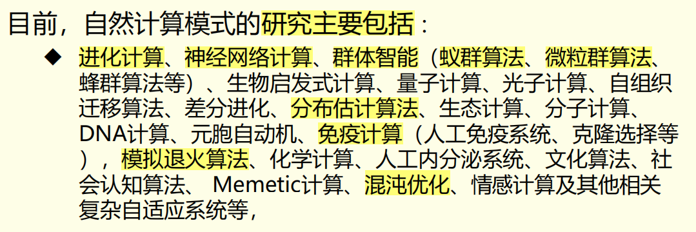
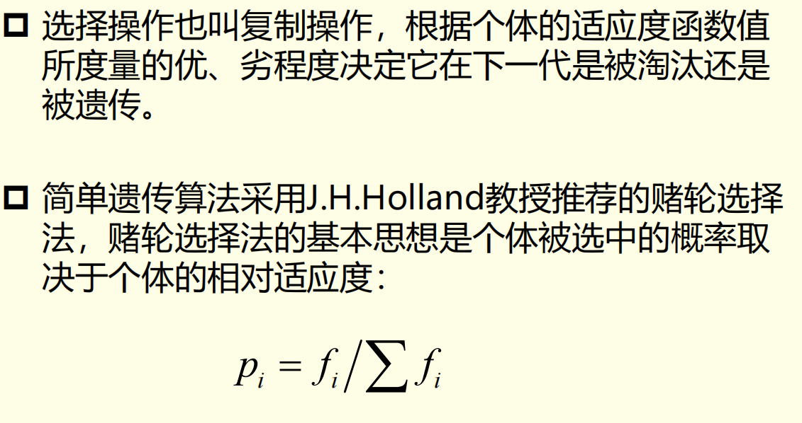
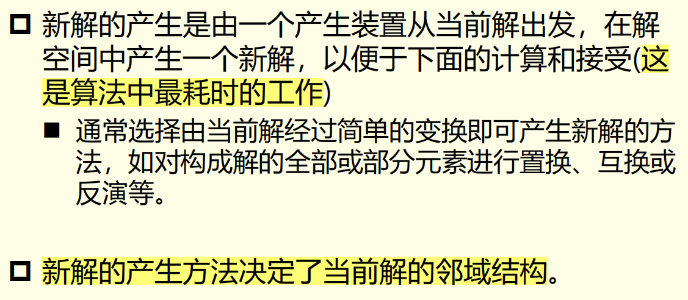
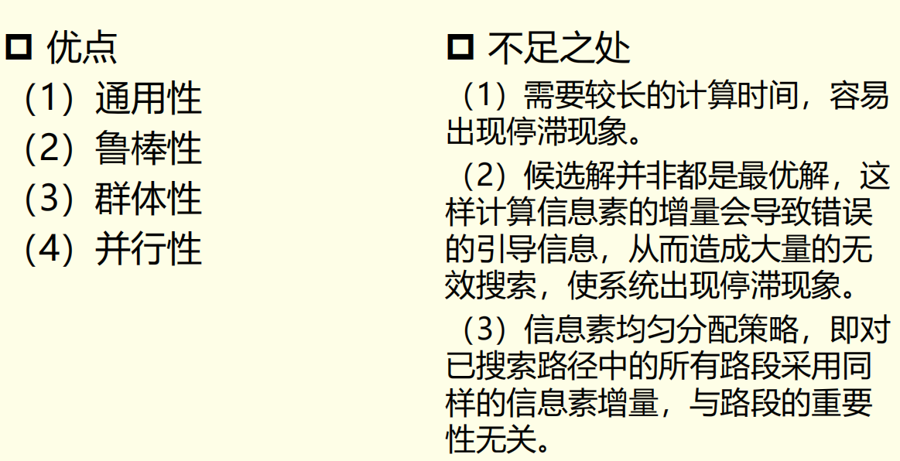
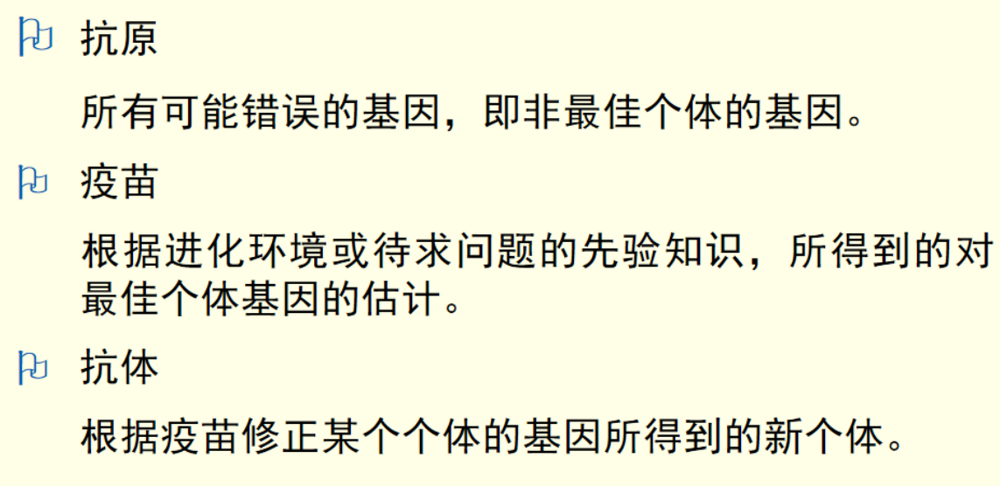
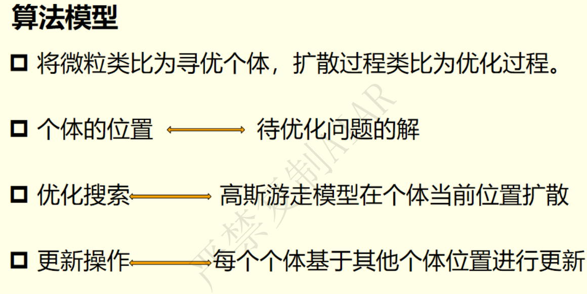

# Review of Natural Computing
## 课堂练习
**自然计算的定义是什么？有什么特点？主要研究分支有哪些？**
绪论中有。定义：以自然界（包括...），尤其是生物体的功能、特点和作用机理为基础，研究其中丰富的信息处理机制，抽取相应的计算模型，设计相应的算法，并在各种领域加以应用。
特点（特征）：**比喻性**地使用**自然系统**潜在的概念、原理和机制。
主要研究分支：进化计算、人工神经网络、模拟退火算法、群体智能（蚁群粒子群）、免疫计算（人工免疫算法）、混沌优化、分布估计算法

**进化计算具有什么特点，他通常应用于哪些领域**
特点7点：有指导搜索、自适应搜索，渐进式寻优、并行式搜索、黑箱式结构、全局最优解、通用性。
应用：人工智能、人工生命、复杂问题的优化、结构性优化。

**试画出简单遗传算法的流程图并描述求解过程**
编码、初始化种群、迭代（计算适应度、选择、交叉、变异）、判断是否满足终止条件

**什么叫模拟退火算法？组合优化与模拟退火有哪些相似性**
模拟固体退火过程的一种拟物智能算法。受物理退火启发，模拟固体的升温、等温、冷却过程，结合Metropolis准则进行科学计算的一种启发式随机寻优算法。
解-粒子状态
最优解-最低能量状态
控制参数-温度
目标函数-能量
初始参数-熔化
Metropolis随机抽样-等温
控制参数的下降-冷却

**Metropolis准则与冷却进度表在模拟退火算法中起到什么作用**
Metropolis准则：接受准则判断是否接受新解，抽样准则判断是否达到平稳分布，是否进入下一个状态。
冷却进度表：记录了一系列重要参数。初始温度、温度衰减、马尔科夫链长度、结束条件等。

**试画出并论述分布估计算法的基本流程**
初始化种群和分布、适应度计算、选择优势个体、估计优势个体概率分布建立概率模型、对模型采样得到新一代种群

**群智能算法与进化计算的异同点有哪些**
同：
1. 都是仿生算法
2. 都是基于种群
3. 一种随机搜索优化算法
4. 根据个体适配信息进行搜索，不受函数的限制（通用）
5. 隐含并行计算
6. 全局最优
7. 可能无法收敛

异：
1. 群智能保留记忆在个体中，进化计算记忆随种群改变
2. 群智能的信息共享是单向的，进化计算种群共享信息
3. 群智能没有编码和遗传操作，参数更少、原理更简单、更易实现

**试论述蚁群算法求解TSP问题的基本流程**
初始化蚁群和分布，添加禁忌表，禁忌表未满则一直循环，根据信息素和启发式信息选择路径，添加禁忌表，禁忌表满，更新信息素，判断结果是否满足要求，不满足清空继续循环。

**粒子群算法的基本原理和特点是什么**
鸟类觅食，追逐最优个体，一群随机粒子，根据惯性（自身运动的信任）、个体最优（个人经验）和全局最优（群体经验）进行搜索。
特点：有记忆性；自适应、自学习、自组织；灵活、稳健、自我组织；全局最优、并行、随机搜索、根据个体适配搜索，不依赖函数；简单参数少。

**模拟退火算法的三大支柱**
新解接受准则和随机数产生器（Metropolis算法）
冷却进度表
新解产生器和邻域结构（邻域结构由新解产生器决定）

**分布估计算法中没有遗传操作，取而代之的是**
建立概率模型和采样

**蚂蚁行进时会释放___作为群体内通讯物质**
信息素

**免疫算子由_____和_____两个操作完成**
接种疫苗、免疫选择

**什么是遗传算法？基本原理和流程图**
遗传算法是一类借鉴生物界**自然选择**和**自然遗传机制**的**随机化搜索算法**

**生物免疫系统的两种应答方式**
初次应答和二次应答

## 1 绪论

以自然界的功能、特点、作用机理为基础→研究信息处理机制→抽取模型→设计算法→加以应用

交叉学科（自然科学+计算机科学），尤其是生命科学和计算机科学

### 进化计算

模拟自然选择机制和信息遗传规律的算法的总称

### 复杂适应系统
包括受化学、物理现象启发的智能算法，如模拟退火、混沌优化

## 2 自然计算的研究综述与统一模型
### 研究方向
#### 进化计算
遗传算法（GA）
进化策略（ES）
进化规划（EP）
遗传编程（GP）
#### 群体智能
蚁群算法（ACO）
粒子群算法（PSO）
#### 免疫计算
人工免疫系统（AIS）
克隆选择
#### 模拟退火算法
模拟退火算法（SA）
#### 复杂适应性系统
经济、生态、神经、计算机网络等系统行为的一般规律

## 进化计算

多点并行分布式全局优化搜索算法

映射关系

### 历史和分支
#### 遗传算法
60年代 最早提出

#### 遗传规划（了解一下就行）

#### 进化策略

### 定义
模拟生物进化过程中的自然选择机制和信息遗传规律的算法的总称

### 进化计算的特点
数学上的实质为搜索寻优算法

有指导、自适应
渐进式寻优、并行式搜索、黑箱式结构
全局最优、通用

### 流程

### 应用

主要还是搜索寻优问题

### 简单遗传算法SGA
#### 解码与编码

#### 产生初始群体
随机方法产生初始种群M
M越大，搜索范围越广，但遗传操作速度也越慢
一般取50-100
#### 计算适应度
#### 选择
轮赌选择法

#### 交叉操作
参数pc

GA区别于其他进化算法的重要特征，最本质的遗传算子

#### 变异
参数pm

#### 终止条件

#### 流程

#### 理论基础
##### 模式理论
实质上是模式的运算

隐并行性

仅适用于二进制编码，无法证明收敛性，不能对算法参数提供实用指导
##### 有限状态马尔科夫链模型
随机抽样，估计最优解在某区域存在的概率
研究收敛性
SGA不收敛到全局最优解
改进：EGA，选择最大适应度个体，可收敛到全局最优解

### 遗传规划
与GA类似，但是在种群初始化和编码方式上有区别
采用分层式编码，分支结点为运算符，叶子结点为终止符

### 进化策略
父代变异产生子代，然后进行选择

变异为主要算子，交叉算子不必需。选择是确定性选择，精英选择，固定选择一定数目的最优个体到下一代
### 进化规划
考虑表现型

### 进化计算与遗传算法的总结
#### 进化计算
##### 定义
模拟生物进化过程中的自然选择机制和信息遗传规律的算法的总称
##### 特点
7点
##### 流程

##### 应用
人工智能、人工生命、结构性优化、复杂问题优化
#### 遗传算法
##### 定义
遗传算法是一类借鉴生物界**自然选择**和**自然遗传机制**的**随机化搜索算法**
##### 特点
交叉和变异
##### 流程
上面有
##### 原理
就是步骤那几个，编码、初始化、适应度、选择、交叉、变异、终止条件，简要说明一下各自是什么。

## 模拟退火算法
### 定义
模拟退火算法（simulated annealing，SA）是源于**固体退火原理**的一种**拟物智能**算法。

### 特点

快、任意选取-前期工作量少、通用
### 原理
物质总是趋于最低的能态
物理退火过程：加温、等温、降温
### 相似性比较

### 设计与原理提出
模拟退火算法(SA) 就是这样一个将退火过程中**系统熵值**类比为**目标函数值F**，来模拟这个退火系统的算法。
Metropolis提出
### 与物理退火的比较

### 主要思想
在搜索区间（二维平面中）随机游走（即随机选择点），再以 Metropolis 抽样准则，使随机游走逐渐收敛于局部最优解。而**温度**即是 Metropolis 算法中的一个重要控制参数，可以认为这个参数的大小**控制**了随时过程向局部或全局最优解移动的**快慢**。

三大支柱
1. 接收准则和随机数产生器（Metropolis算法）
2. 冷却进度表
3. 新解产生器和邻域结构

### 流程

满足Metropolis接受准则，接受新解；满足Metropolis抽样稳定准则（达到平稳分布）更新状态，降低温度，否则就要一直尝试新解。

### Metropolis准则
以概率接受新解
$e^{-{\Delta E \over {k_BT}}}$
### 实现思想

固体退火-组合优化
内能E-函数f
温度T-控制参数t
### 冷却进度表

一系列参数
温度、温度衰减、马尔科夫链长度、结束条件
#### 参数选择
##### 初始温度
大时易搜索到全局最优解，但算的慢
##### 衰减K
接近于1的常数
$T*=K$
##### 马尔科夫链长度$L_k$
每次迭代产生的变换数
##### 终止条件
### 新解的产生和邻域结构

### 例：TSP问题

这个L就是每个温度下要进行这么多的抽样，才会降低温度

**虽不是最优解，只是近似全局最优，但效率高**

## 分布估计算法 EDA
### 定义&本质
分布估计算法（Estimation of Distribution Algorithms，EDA）本质上是一种**基于概率模型**的**新型进化算法**，是自然计算的又一典型实现模式

### 与遗传算法的关系
和遗传算法的算法结构相比，分布估计算法没有交叉算子和变异算子，取而代之的是**建立概率模型**和**采样**两大操作。

建立概率模型和采样是分布估计算法的核心步骤，也是 EDA 与 GA 的最大不同之处。

由于分布估计算法没有 交叉 和 变异 操作，因而通常不用**基因**来描述个体所包含的信息，取而代之的是**变量**(Variables) 。
### 思想
分布估计算法的主要思想就是把**自然进化算法**和**构造性数学分析方法**相结合，以指导对问题空间的有效搜索。这种**将构造性概率模型引入进化算法的思想**形成了分布估计算法的理论依据。

分布估计算法的基本思想就是使用概率的方法描述和表示每一代群体

### 流程

选择→估计分布→采样新一代个体
估计分布：建立概率模型，统计学习方法
采样：蒙特卡洛方法

### 高斯概率模型
建模连续变量
每一个变量满足一维高斯分布

均值更新：种群最优、次优和最差
方差更新：用选择后的种群计算方差然后增量式更新
### 应用
函数优化、组合优化、生物信息学
生物信息学：基因结构分析、DNA分类聚类、蛋白质结构预测和设计

## 群智能算法
### 特点
指无智能的主体通过合作表现出智能行为的特性，在没有集中控制且不提供全局模型的前提下，为寻找复杂的分布式问题求解方案提供了基础
### 优点
1. 灵活性：群体可以随时适应环境变化
2. 稳健性：即使个体失败，群体也能完成任务
3. 自我组织：活动即不受中央控制，也不受局部监管

### 蚁群算法
信息素（派洛蒙）

搜索范围&局部环境（全局和局部）
觅食-移动-避障-通信
#### 蚁群算法解决TSP

不能访问已经访问过的城市，当j在禁忌表中时访问概率为0
概率为信息素和启发式的加权，归一化

每只蚂蚁在一条路径上留下信息素$Q\over{L_k}$，所有蚂蚁的信息素总和加上蒸发后的原有信息素得到这条路径上的信息素
#### 流程

#### 优缺点分析

计算时间长、停滞、无效搜索、信息素分配没有考虑路段重要性

#### 参数影响分析

### 粒子群算法
#### 定义
源于对鸟群捕食行为的研究，是基于迭代的方法
#### 原理
初始化为一群随机粒子，通过迭代找到最优。每次迭代中，粒子通过跟踪“个体极值（pbest）”和“全局极值(gbest)”来更新自己的位置。

速度是原速度（惯性）、个体极值方向、全局极值方向的加权
w：惯性权重 c：加速因子
惯性、认知、社会
#### 流程

#### 参数分析
##### 惯性权重w
w利于搜索空间的扩展，大w利于跳出局部最优，小w利于算法收敛
##### 加速因子c
小的c使粒子在目标区域附近徘徊，大的c使粒子突然冲向或越过目标

#### 与遗传算法比较

共性：
1. 仿生
2. 全局优化
3. 随机搜索
4. 并行
5. 根据适配信息进行搜索
6. 可能无法收敛

其实就是遗传的几个特点

差异：
1. PSO有记忆，记忆保存在粒子中，但GA保存在种群中，随种群改变
2. PSO单向共享，GA相互共享
3. PSO没有编码和遗传，原理更简单、参数更少、更易实现

#### 应用
神经网络训练、参数优化、组合优化

### 群智能算法总结

缺乏理论依据，研究不足，不具备绝对可信性，存在应用风险。

## 人工免疫计算
### 生物免疫的两种类型
特异性免疫、非特异性免疫
### 基本概念

### 免疫系统
两个部分：固有免疫系统和自适应免疫系统
自适应免疫又分体液免疫和细胞免疫
### 免疫应答
初次应答和二次应答
学习和记忆抗原
### 免疫+遗传

免疫算子由**接种疫苗**和**免疫选择**两个操作完成，(免疫选择又包括免疫检测和退火选择)
### 免疫算法
#### 流程

相较于遗传算法多了抽取疫苗和后续对变异完的种群进行接种疫苗和免疫选择操作（免疫选择代替了选择）

### 免疫规划
免疫+进化规划
### 免疫策略
免疫+遗传策略
### 机理

### 免疫算法流程

多了一个疫苗提取和接种疫苗

## 混沌
### 定义

对初值敏感

广义随机性和缺乏确定性是一个意思（广义随机：不完全的随机，比如洗牌，依赖上一次洗牌的结果）

每个状态可以计算，但是微小扰动就会看起来随机

敏感地依赖于**初始条件**

**貌似随机的确定性**

### 特性

### 混沌优化算法
利用混沌变量进行搜索，容易跳出局部最优

### 分形几何
Koch曲线，有界但无限，自相似性
#### 维数

n是分成的小块的数目，x是每个小块的长度
维数描述了复杂性、无序性、填充空间的能力

#### 随机分形搜索算法

##### 流程

