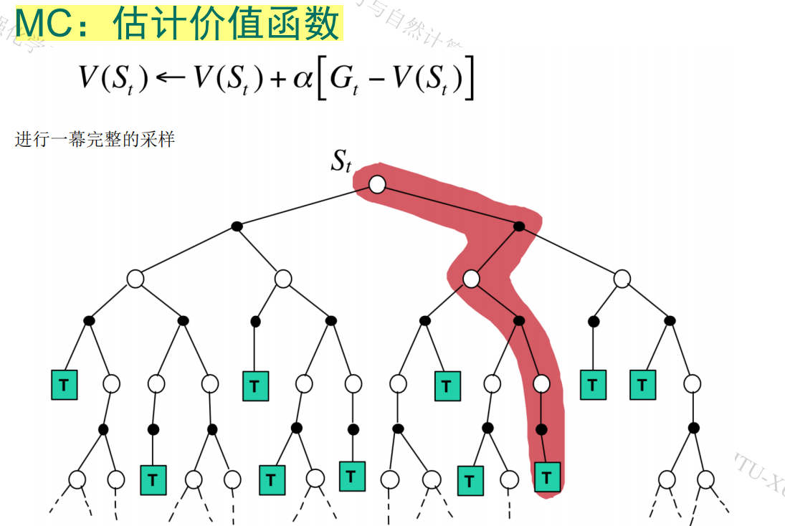
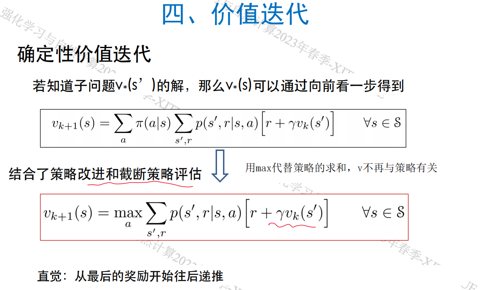

# Review of Reinforcement Learning
## 概述
强化学习：让智能体在动态环境中学习动作和达成目标。

智能：在动态、开放环境中达到目标的能力

智能体：有目标，感知-动力闭环的系统

学习：利用经验E在任务T上获得性能P的改善，则关于T和P，对E进行了学习

与监督学习的区别：监督学习使用带标注的训练集使智能体具备可泛化的决策能力。但不可能在所有情境下都获得既正确又有代表性的动作示例，智能体必须从自身经验中学习。

与无监督学习的区别：
无监督学习寻找未标注数据的隐含结构，强化学习最大化收益。

强化学习的问题：智能体如何高效地从与环境交互中学习，以获得自适应性？
特点：
1. 交互、试错学习
2. 无监督信号，只有奖励信号
3. 奖励不一定实时

从交互信息中发现因果关系、动作的后果，以及达到目标的方式。

## 赌博机
探索/利用（开发）
### 问题描述

找到平均获益最大的臂
### 动作-价值方法

*q~*~(a)* 是实际动作价值，*Q~t~(a)* 是t时刻对动作价值的估计。
#### 采样平均法
用动作的平均收益估计期望收益
### 平衡探索与利用：ε-贪心
贪心策略一直在守成（利用），不断选择获益最高的动作
ε-贪心：大概率贪心，以小概率ε随机选择动作

#### 采样平均法的增量形式
平均动作-价值估计：Q = (Q × (N-1) + R) / N，把Q单独拿出来
Q = Q + (R - Q) / N
Q += (R - Q) / N

#### 测试结果

### 非平稳问题
如果真实的动作价值随时间变化，采样平均法就不适用了（因为有时间的概念，近期的结果显然对估计更有帮助，久远的结果就不太有参考价值了）
**<u>引入指数因子</u>**
Q~n+1~ = Q~n~ + α(R~n~ - Q~n~)
对比之前的Q = Q + (R - Q) / N

Q~n+1~ = Q~n~ + α(R~n~ - Q~n~)
= (1-α)Q~n~ + αR~n~
即每次迭代时为之前的Q施加一个折扣权值(1-α)，并以一定的权重增加获益R，之前的估计获益就会随时间逐渐衰减。

#### 收敛性

### 乐观初始值
在进行上述问题求解时需要设置初始值Q~1~，之前设置的是0，但可以设置一个乐观初始值，如5，可以提供一种简单的试探方法。

### 基于置信度上界UCB的动作选择
也是一种平衡探索-利用的策略，考虑动作估计值有多接近最大值和他们的不确定性（不确定性越高越需要尝试一下这个动作）
UCB估计其实就是在某个置信度下取置信区间的上界作为动作价值估计。

$\sqrt[]{{logt}\over{N_t(a)}}$是不确定性度量，值越大说明在较长的时间内对a的探索较少，不确定性就大。
选一个价值估计大且不确定的动作
效果比$\epsilon$-贪心要好点
### 梯度赌博机算法

第t次迭代：
以一定概率选中动作a，概率通过$H_t(a)$的softmax计算得到；
$H_{t+1}(a)$的更新公式如图，$1\{A_t=a\}$是指示函数，如果第t次迭代选择的动作是a则函数值为1，反之为0；每次迭代都要对所有动作的$H$进行更新，更新公式由梯度下降推得；
平均收益的计算如图。
### 赌博机算法比较

## 问题描述
非关联任务
关联任务

## DP与MC的对比

### DP

动态规划的策略评估，然后贪心进行策略优化，这个是标准的DP

价值迭代，直接取动作的最大值作为动作选择（合并了策略评估和策略改进）

异步DP：前面都是同步DP，即价值的更新是同步的，需要先用一个数组v存储V，再对V的所有状态 ***同时*** 进行更新。现采用异步DP，就是每个状态直接就地更新，不需要同时对整个V进行更新
### MC
#### 策略评估
对各状态价值进行评估

#### 策略控制
还要对策略进行优化改进，所以需要计算状态-动作价值即Q

存在问题：不能保证对每个动作都探索到（因为一直贪心选择，只有利用没有探索）
需要软策略
#### 引入软策略
##### 同轨
待学习策略$\pi$本身就是一个软策略，同轨是指行动策略和需要学习的策略一致，怎么学就怎么动。
这里以$\epsilon$-贪心策略为软策略。

##### 离轨
从别人的行动经验中学习，待学习策略和行动（采样）策略不一致。可以从一个软策略中学习，最终得到一个贪心策略。
离轨评估

离轨控制
使用贪心策略为待学习策略$\pi$，因为是贪心策略，所以W更新时分子就直接是1了（只会采用最优的动作）

## TD(0)
### Sarsa

### Q-Learning

### 对比
在状态-价值更新时不同；并且Sarsa的下一个A承接A'，因为是同轨的，待评估策略与行动策略一致。但Q-Learning就不是了，A是待学习策略决定的，而后继动作A'是贪心策略选择的，所以不能直接挪用。
## TD(n)
以n步采样得到的总收益G作为预计收益
### 策略评估

### 策略控制
#### n步SARSA
进行n步采样，用n步采样的总收益G代替SARSA中一步采样的收益R

相对于单步SARSA加快了策略学习
#### 离轨
##### 利用重要性采样

##### n步回溯树：不用重要性采样
直接用回溯树算出每步期望获益，就不需要再从b中去采样$\pi$了

